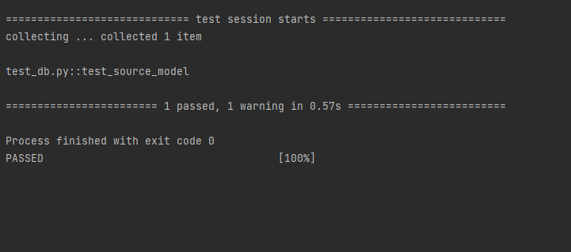
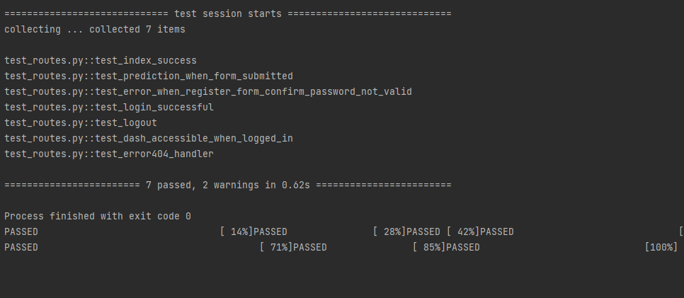

# COMP0034 Coursework 2 individual group 85
### This project creates an app using Flask that deploys an ML model.
### To set up this project:

1. Clone this repository in your IDE. URL:https://github.com/ucl-comp0035/comp0034-cw2-i-KevinHe0805.git
2. Create and then activate a virtual environment (venv).
3. Install the requirements from requirements.txt. `pip install -r requirements.txt`\
or install setup.py `pip install -e .`

4. Edit .gitignore to add any config files and folders for your IDE. 
5. run the flask app by typing `python -m flask --app 'oil_and_gas_app:create_app()' --debug run --port 5001` in terminal.

## Testing

Testing results of test_db

Testing results of test_routes

All tests passed successfully.